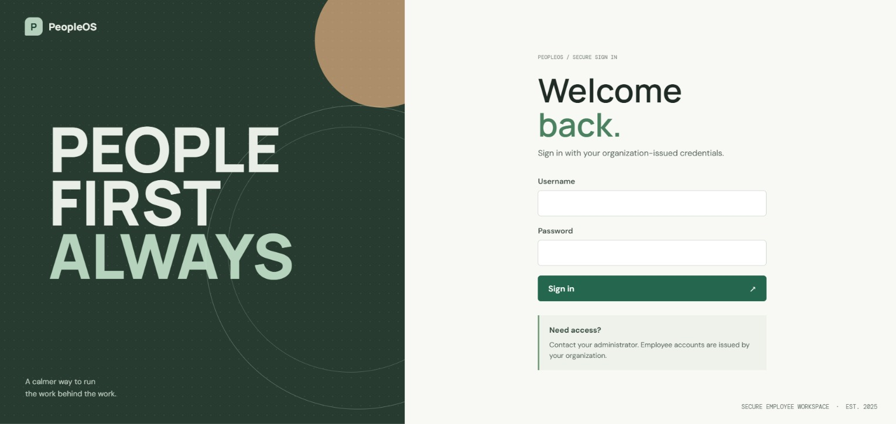

# Employee Management System

A full-stack Employee Management System built with **Spring Boot**, **Spring Data JPA**, **Spring Security**, **JWT authentication**, **MySQL**, **React**, and **Vite**.

The application provides centralized employee, department, attendance, leave, payroll, notification, and role-management capabilities with role-based access control.

## Live Application

**Frontend:**  
https://employee-management-six-delta.vercel.app/

**Backend API:**  
https://zippy-reprieve-production-687e.up.railway.app/

> The frontend is deployed on Vercel and the Spring Boot backend is deployed on Railway.

---

### Application Preview

### Login Page

The Employee Management System uses a PeopleOS-inspired employee workspace login experience with a clean, professional interface.



# Table of Contents

- [Project Overview](#project-overview)
- [Key Features](#key-features)
- [Technology Stack](#technology-stack)
- [Application Architecture](#application-architecture)
- [Authentication and Security](#authentication-and-security)
- [Roles and Access Control](#roles-and-access-control)
- [Functional Modules](#functional-modules)
- [Database Design](#database-design)
- [Backend Project Structure](#backend-project-structure)
- [Frontend Project Structure](#frontend-project-structure)
- [REST API](#rest-api)
- [Local Setup](#local-setup)
- [Environment Variables](#environment-variables)
- [Database Initialization](#database-initialization)
- [Running the Backend](#running-the-backend)
- [Running the Frontend](#running-the-frontend)
- [Deployment](#deployment)
- [Typical Workflow](#typical-workflow)
- [Validation and Error Handling](#validation-and-error-handling)
- [Security Considerations](#security-considerations)
- [Known Limitations](#known-limitations)
- [Troubleshooting](#troubleshooting)
- [Future Enhancements](#future-enhancements)
- [Author](#author)

---

## Project Overview

The Employee Management System is designed as a production-style full-stack web application for managing employees and common HR/organization workflows.

The system follows a layered backend architecture:

```text
React Frontend
      |
      | HTTP / JSON
      v
Spring Boot REST API
      |
      +---- Spring Security + JWT
      |
      +---- Controllers
      |
      +---- Services
      |
      +---- Repositories
      |
      +---- JPA / Hibernate
      |
      v
MySQL Database
```

The frontend communicates with the backend using REST APIs through Axios.

Authentication is token-based. After successful login, the backend returns a JWT. The frontend sends that token with subsequent API requests using:

```http
Authorization: Bearer <token>
```

---

## Key Features

### Employee Management

- Create employees
- View employee profiles
- Edit employee information
- Delete employees
- Search employees
- Sort employee records
- Assign departments
- Assign team managers
- Maintain employee login credentials
- Maintain employee roles and account status

### Role-Based Access Control

The application supports five roles:

- `ADMIN`
- `HR`
- `FINANCE`
- `TEAM_MANAGER`
- `EMPLOYEE`

Access is enforced both in the React frontend and on the Spring Boot backend.

### Department Management

- Create departments
- View departments
- Update departments
- Delete departments
- View employees belonging to a department
- Prevent deletion of departments that still have employee assignments

### Attendance

- Employee check-in
- Employee check-out
- View personal attendance
- ADMIN/HR organization-wide attendance
- TEAM_MANAGER direct-report attendance
- Attendance status tracking

Supported attendance statuses include:

- `PRESENT`
- `ABSENT`
- `HALF_DAY`
- `ON_LEAVE`

### Leave Management

Employees can:

- Apply for leave
- View their own leave history
- Cancel eligible pending requests

Supported leave types include:

- `CASUAL`
- `SICK`
- `EARNED`
- `UNPAID`

TEAM_MANAGER users can manage pending leave requests for their direct reports.

### Payroll

ADMIN and FINANCE users can:

- Create payroll records
- View payroll records
- Update payroll records
- Manage base salary
- Manage allowances
- Manage deductions
- Track effective dates
- View backend-calculated net salary

### Notifications

The application provides:

- Notification inbox
- Unread notification count
- Unread notification list
- Mark one notification as read
- Mark all notifications as read

Notifications are scoped to the authenticated employee.

### User / Access Administration

ADMIN users can:

- View employee accounts
- Change employee roles
- Enable accounts
- Disable accounts

A separate user table is not required in the current architecture. Authentication information is stored on the `Employee` entity itself.

---

# Technology Stack

## Backend

| Technology | Purpose |
|---|---|
| Java 17 | Backend programming language |
| Spring Boot 4.1.1 | Application framework |
| Spring Web MVC | REST API |
| Spring Data JPA | Persistence layer |
| Hibernate | ORM |
| Spring Security | Authentication and authorization |
| BCrypt | Password hashing |
| JWT / JJWT 0.12.6 | Stateless authentication |
| MySQL | Relational database |
| Maven | Build and dependency management |
| Jakarta Validation | Request validation |

## Frontend

| Technology | Purpose |
|---|---|
| React 19 | UI framework |
| Vite 6 | Frontend build tool |
| React Router 7 | Client-side routing |
| Axios | HTTP API communication |
| Context API | Authentication/toast state management |
| JavaScript / JSX | Frontend development |
| CSS | UI styling |

## Deployment

| Platform | Component |
|---|---|
| Vercel | React frontend |
| Railway | Spring Boot backend |
| MySQL | Application database |

---

# Application Architecture

## Backend Architecture

The backend follows a layered architecture:

```text
Controller
    |
    v
Service Interface
    |
    v
Service Implementation
    |
    v
Repository
    |
    v
Entity
    |
    v
MySQL
```

### Controller Layer

Controllers expose REST endpoints and handle HTTP requests.

Examples:

- `AuthController`
- `EmployeeController`
- `DepartmentController`
- `AttendanceController`
- `LeaveController`
- `PayrollController`
- `NotificationController`
- `UserController`
- `DashboardController`

### Service Layer

Business rules are implemented in service classes and their implementations.

Examples:

- `EmployeeService`
- `EmployeeServiceImpl`
- `AttendanceService`
- `AttendanceServiceImpl`
- `LeaveServiceImpl`
- `PayrollServiceImpl`
- `NotificationServiceImpl`
- `DashboardServiceImpl`
- `UserServiceImpl`

### Repository Layer

Spring Data JPA repositories communicate with the database.

Examples:

- `EmployeeRepository`
- `DepartmentRepository`
- `AttendanceRepository`
- `LeaveRequestRepository`
- `PayrollRepository`
- `NotificationRepository`

### Entity Layer

The main entities are:

```text
Employee
Department
Attendance
LeaveRequest
Payroll
Notification
```

The `Employee` entity also contains authentication-related fields:

```text
username
password
enabled
role
```

and has relationships with:

```text
Department
Manager (another Employee)
```

---

# Authentication and Security

The application uses **JWT-based stateless authentication**.

## Login Flow

```text
User
 |
 | username + password
 v
POST /auth/login
 |
 v
Spring Security AuthenticationManager
 |
 v
Employee credentials
 |
 | BCrypt password verification
 v
JWT generated
 |
 v
Frontend stores JWT in session
 |
 v
JWT sent with protected API requests
```

The JWT contains:

- Username
- Role
- Issued-at timestamp
- Expiration timestamp

The frontend sends the token using:

```http
Authorization: Bearer <JWT>
```

## Password Security

Passwords are never intentionally stored as plain text.

The backend uses:

```java
BCryptPasswordEncoder
```

When an employee is created, the submitted password is encoded before persistence.

Example conceptually:

```text
Password@123
      |
      v
BCrypt
      |
      v
$2a$10$................................................
```

## JWT Configuration

The following environment variables are used:

```text
JWT_SECRET
JWT_EXPIRATION
```

Never commit the real JWT secret to source control.

---

# Roles and Access Control

## ADMIN

Full administrative access.

Typical capabilities:

- Dashboard
- Employee management
- Employee deletion
- Department management
- User/role administration
- Attendance
- Payroll
- Manager assignment
- Employee salary access

## HR

Human-resources access.

Typical capabilities:

- Employee creation/editing
- Employee directory
- Department management
- Manager assignment
- Attendance
- Employee profiles
- Leave-related HR operations permitted by the backend

## FINANCE

Finance/payroll access.

Typical capabilities:

- Payroll management
- Own attendance
- Own profile
- Notifications

FINANCE does not have access to the employee directory.

## TEAM_MANAGER

Team management access.

Typical capabilities:

- Assigned employee directory
- Direct-report profiles
- Team attendance
- Pending leave requests from direct reports
- Own attendance
- Own profile
- Notifications

A manager assignment is valid only when the selected manager has the `TEAM_MANAGER` role.

A manager cannot be assigned to themselves.

## EMPLOYEE

Regular employee access.

Typical capabilities:

- Own profile
- Own attendance
- Own leave requests
- Notifications
- Permitted employee profile access

---

# Role Access Matrix

| Area / Action | ADMIN | HR | FINANCE | TEAM_MANAGER | EMPLOYEE |
|---|:---:|:---:|:---:|:---:|:---:|
| Dashboard | Yes | Limited | Limited | Team-focused | Personal |
| Employee directory | Yes | Yes | No | Assigned team | No |
| Create employee | Yes | Yes | No | No | No |
| Edit employee | Yes | Yes | No | No | No |
| Delete employee | Yes | No | No | No | No |
| Assign manager | Yes | Yes | No | No | No |
| User/role administration | Yes | No | No | No | No |
| Departments | Yes | Yes | No | No | No |
| Attendance | Organization | Organization | Own | Team | Own |
| Leave | Own/admin rules | Own/admin rules | Own | Team + own | Own |
| Payroll | Yes | No | Yes | No | No |
| Notifications | Own | Own | Own | Own | Own |
| Own profile | Yes | Yes | Yes | Yes | Yes |

Frontend route restrictions improve usability, but backend authorization remains the final security boundary.

---

# Functional Modules

## 1. Login

Route:

```text
/login
```

Users authenticate using:

- Username
- Password

The backend returns a JWT on successful authentication.

---

## 2. Dashboard

The dashboard provides role-specific information.

ADMIN receives organization-level information such as:

- Total employees
- Total departments
- Pending leaves
- Payroll information
- Department employee counts
- Attendance information

Other roles receive data appropriate to their permissions.

---

## 3. Employees

The employee directory supports:

- Search
- Sorting
- View
- Create
- Edit
- Delete
- Manager assignment

Employee search can match information such as:

- Employee code
- Name
- Email
- Phone
- Department
- Designation
- Manager

---

## 4. Departments

Departments can be managed by ADMIN and HR.

Examples of departments used by the application include:

- Engineering
- Human Resources
- Finance
- Marketing
- Sales
- Customer Support
- Operations
- Information Technology
- Legal
- Administration

---

## 5. Manager Assignment

A manager relationship is stored as:

```text
Employee -> manager -> Employee
```

The assigned manager must have:

```text
TEAM_MANAGER
```

role.

Example:

```text
TEAM_MANAGER
Rohit Nair

       |
       +---- Employee A
       +---- Employee B
       +---- Employee C
```

---

## 6. Attendance

The system prevents duplicate daily check-ins and validates check-out operations.

Typical flow:

```text
Check In
   |
   v
PRESENT
   |
   v
Check Out
```

---

## 7. Leave

Typical leave workflow:

```text
Employee applies
      |
      v
   PENDING
      |
      +---- TEAM_MANAGER approves
      |
      +---- TEAM_MANAGER rejects
      |
      +---- Employee cancels while pending
```

The backend validates:

- Leave type
- Start date
- End date
- Date ordering
- Overlapping pending/approved leave
- Ownership
- Manager relationship

---

## 8. Payroll

Payroll records contain:

```text
Employee
Base Salary
Allowances
Deductions
Effective From
Net Salary
```

The backend is the source of truth for the resulting `netSalary`.

---

## 9. Notifications

Leave decisions and other supported business events can generate notifications.

Users can:

- View notifications
- View unread notifications
- View unread count
- Mark individual notifications as read
- Mark all notifications as read

---

# Database Design

The application uses MySQL with database name:

```text
employee_management
```

Hibernate is configured with:

```properties
spring.jpa.hibernate.ddl-auto=update
```

## Main Tables

The main tables correspond to:

```text
employees
departments
attendance
leave_requests
payroll
notifications
```

The `employees` table contains both employee and authentication information.

Important employee fields include:

```text
id
employee_code
first_name
last_name
email
phone
designation
salary
username
password
enabled
role
department_id
manager_id
```

## Employee Relationships

```text
Department
    |
    +---- Employees

Employee
    |
    +---- Department
    |
    +---- Manager (Employee)
    |
    +---- Attendance
    |
    +---- Leave Requests
    |
    +---- Payroll
    |
    +---- Notifications
```

---

# Database Initialization

The repository contains:

```text
ems.sql
bootstrap-admin.sql
```

## Important Warning

`ems.sql` contains a destructive reset:

```sql
DROP DATABASE IF EXISTS employee_management;
```

This permanently removes the existing database and its data.

Only execute it when intentionally resetting the application database.

Recommended fresh setup:

```text
1. Run ems.sql
2. Start Spring Boot
3. Hibernate creates/updates the schema
4. Run bootstrap-admin.sql
5. Log in as ADMIN
6. Create employees through the application
```

For an existing production database, do not execute `ems.sql`.

---

# REST API

The backend base URL is:

```text
https://zippy-reprieve-production-687e.up.railway.app
```

## Authentication

| Method | Endpoint | Purpose |
|---|---|---|
| POST | `/auth/login` | Authenticate user and return JWT |

Example request:

```json
{
  "username": "admin",
  "password": "your-password"
}
```

---

## Employee API

| Method | Endpoint | Access |
|---|---|---|
| POST | `/employees` | ADMIN, HR |
| GET | `/employees` | ADMIN, HR, TEAM_MANAGER |
| GET | `/employees/me` | All authenticated roles |
| PUT | `/employees/me` | All authenticated roles |
| GET | `/employees/{id}` | ADMIN, HR, TEAM_MANAGER, EMPLOYEE |
| PUT | `/employees/{id}` | ADMIN, HR |
| DELETE | `/employees/{id}` | ADMIN |
| GET | `/employees/{id}/salary` | ADMIN, FINANCE |
| PUT | `/employees/{employeeId}/manager/{managerId}` | ADMIN, HR |

### Create Employee Example

```json
{
  "employeeCode": "EMP-001",
  "firstName": "Rahul",
  "lastName": "Sharma",
  "email": "rahul.sharma@example.com",
  "phone": "9876501001",
  "departmentId": 1,
  "designation": "Software Engineer",
  "salary": 65000,
  "username": "rahul.sharma",
  "password": "Password@123"
}
```

---

## Department API

| Method | Endpoint | Access |
|---|---|---|
| POST | `/departments` | ADMIN, HR |
| GET | `/departments` | ADMIN, HR |
| GET | `/departments/{id}` | ADMIN, HR |
| PUT | `/departments/{id}` | ADMIN, HR |
| DELETE | `/departments/{id}` | ADMIN |
| GET | `/departments/{id}/employees` | ADMIN, HR |

---

## Attendance API

| Method | Endpoint | Access |
|---|---|---|
| POST | `/attendance/check-in` | Authenticated |
| PUT | `/attendance/check-out` | Authenticated |
| GET | `/attendance/my` | Authenticated |
| GET | `/attendance/employee/{employeeId}` | ADMIN, HR, TEAM_MANAGER |
| GET | `/attendance` | ADMIN, HR |

---

## Leave API

| Method | Endpoint | Purpose |
|---|---|---|
| POST | `/leaves` | Apply for leave |
| GET | `/leaves/my` | View own leaves |
| GET | `/leaves/team/pending` | Team manager pending leaves |
| PUT | `/leaves/{id}/approve` | Approve leave |
| PUT | `/leaves/{id}/reject` | Reject leave |
| PUT | `/leaves/{id}/cancel` | Cancel own pending leave |

---

## Payroll API

| Method | Endpoint | Access |
|---|---|---|
| POST | `/payroll/employees/{employeeId}` | ADMIN, FINANCE |
| GET | `/payroll/employees/{employeeId}` | ADMIN, FINANCE |
| GET | `/payroll` | ADMIN, FINANCE |
| PUT | `/payroll/employees/{employeeId}` | ADMIN, FINANCE |

Example payroll request:

```json
{
  "baseSalary": 65000,
  "allowances": 5000,
  "deductions": 2500,
  "effectiveFrom": "2026-10-01"
}
```

---

## Notification API

| Method | Endpoint | Purpose |
|---|---|---|
| GET | `/notifications` | Get notifications |
| GET | `/notifications/unread` | Get unread notifications |
| GET | `/notifications/unread/count` | Get unread count |
| PUT | `/notifications/{id}/read` | Mark one as read |
| PUT | `/notifications/read-all` | Mark all as read |

---

## User Administration API

ADMIN only:

| Method | Endpoint | Purpose |
|---|---|---|
| GET | `/users` | List employee accounts |
| PUT | `/users/{id}/status?enabled=true/false` | Enable/disable account |
| PUT | `/users/{id}/role` | Change role |

Example role update:

```json
{
  "role": "TEAM_MANAGER"
}
```

Supported roles:

```text
ADMIN
HR
FINANCE
TEAM_MANAGER
EMPLOYEE
```

---

# Local Setup

## Prerequisites

Install:

- Java 17
- Maven or use the included Maven Wrapper
- MySQL 8.x
- Node.js
- npm
- Git
- IDE such as Spring Tool Suite (STS), IntelliJ IDEA, or Eclipse

Verify Java:

```bash
java -version
```

Verify Node:

```bash
node -v
```

Verify npm:

```bash
npm -v
```

---

# Environment Variables

## Backend

The backend reads configuration from environment variables.

Create a `.env` file in the backend project directory:

```properties
DB_URL=jdbc:mysql://localhost:3306/employee_management
DB_USERNAME=root
DB_PASSWORD=your_mysql_password

JWT_SECRET=your_long_random_secret_key
JWT_EXPIRATION=3600000

FRONTEND_URL=http://localhost:5173
```

The application uses:

```properties
spring.config.import=optional:file:.env[.properties]
```

Do not commit real secrets.

---

## Frontend

Create:

```text
frontend/.env
```

Example:

```properties
VITE_API_BASE_URL=http://localhost:8080
```

For the deployed application, the frontend uses the Railway backend URL:

```properties
VITE_API_BASE_URL=https://zippy-reprieve-production-687e.up.railway.app
```

---

# Running the Backend

From the project root:

### Windows

```bash
mvnw.cmd spring-boot:run
```

or:

```bash
mvnw.cmd clean package
java -jar target/employee-management-0.0.1-SNAPSHOT.jar
```

### Linux / macOS

```bash
./mvnw spring-boot:run
```

The backend normally runs on:

```text
http://localhost:8080
```

The deployed backend receives the port from Railway:

```properties
server.port=${PORT:8080}
```

---

# Running the Frontend

Navigate to:

```bash
cd frontend
```

Install dependencies:

```bash
npm install
```

Start development server:

```bash
npm run dev
```

Vite normally starts at:

```text
http://localhost:5173
```

Build for production:

```bash
npm run build
```

Preview the production build:

```bash
npm run preview
```

---

# Deployment

## Frontend Deployment - Vercel

The React frontend is deployed on Vercel.

Live URL:

https://employee-management-six-delta.vercel.app/

The frontend build is generated with:

```bash
npm run build
```

Vercel serves the generated Vite application.

Required environment variable:

```text
VITE_API_BASE_URL
```

Production value:

```text
https://zippy-reprieve-production-687e.up.railway.app
```

---

## Backend Deployment - Railway

The Spring Boot backend is deployed on Railway.

Backend URL:

```text
https://zippy-reprieve-production-687e.up.railway.app
```

Railway environment variables should include:

```text
DB_URL
DB_USERNAME
DB_PASSWORD
JWT_SECRET
JWT_EXPIRATION
FRONTEND_URL
```

Example:

```text
FRONTEND_URL=https://employee-management-six-delta.vercel.app
```

The backend reads Railway's dynamically assigned port through:

```properties
server.port=${PORT:8080}
```

---

# CORS Configuration

The backend reads the deployed frontend URL from:

```properties
app.frontend.url=${FRONTEND_URL:http://localhost:5173}
```

CORS allows:

- Configured frontend origin
- `http://localhost:*`
- `http://127.0.0.1:*`

Allowed HTTP methods:

```text
GET
POST
PUT
DELETE
OPTIONS
```

Allowed headers include:

```text
Authorization
Content-Type
Accept
```

---

# Frontend Routing

Important routes include:

```text
/login
/dashboard
/profile
/employees
/employees/:id
/users
/departments
/departments/:id
/leaves
/leaves/pending
/payroll
/attendance
/notifications
```

Route access is protected using:

```text
ProtectedRoute
RoleBasedRoute
GuestRoute
```

---

# Frontend Project Structure

```text
frontend/
├── public/
├── src/
│   ├── assets/
│   ├── components/
│   ├── context/
│   ├── hooks/
│   ├── layouts/
│   ├── pages/
│   ├── routes/
│   ├── services/
│   ├── utils/
│   ├── App.jsx
│   ├── main.jsx
│   └── styles.css
├── .env
├── .env.example
├── package.json
├── vite.config.js
└── vercel.json
```

## Services

The frontend separates API calls into services such as:

```text
api.js
authService.js
employeeService.js
departmentService.js
attendanceService.js
leaveService.js
payrollService.js
notificationService.js
dashboardService.js
userService.js
```

This keeps page components separate from API communication.

---

# Backend Project Structure

```text
src/
└── main/
    ├── java/
    │   └── com/example/employeemanagement/
    │       ├── config/
    │       ├── controller/
    │       ├── dto/
    │       ├── entity/
    │       ├── exception/
    │       ├── repository/
    │       ├── security/
    │       ├── service/
    │       └── EmployeeManagementApplication.java
    │
    └── resources/
        ├── application.properties
        ├── static/
        └── templates/
```

---

# Typical Application Workflow

## Initial Setup

```text
Create MySQL database
        |
        v
Start Spring Boot
        |
        v
Hibernate creates/updates tables
        |
        v
Create/bootstrap ADMIN
        |
        v
Login as ADMIN
```

## Employee Creation

```text
ADMIN / HR
     |
     v
Create Employee
     |
     +---- Employee details
     +---- Department
     +---- Designation
     +---- Salary
     +---- Username
     +---- Temporary password
     |
     v
BCrypt password hashing
     |
     v
Employee account created
     |
     v
Default role = EMPLOYEE
```

## Role Assignment

```text
ADMIN
  |
  v
Employee Access
  |
  +---- EMPLOYEE
  +---- HR
  +---- FINANCE
  +---- TEAM_MANAGER
  +---- ADMIN
```

## Manager Assignment

```text
ADMIN / HR
     |
     v
Select employee
     |
     v
Enter TEAM_MANAGER employee ID
     |
     v
Backend validates manager role
     |
     v
manager_id stored
```

---

# Validation and Error Handling

The backend uses Jakarta Validation for request validation.

Examples:

- Required fields cannot be blank
- Email must have a valid format
- Salary must be positive
- Username must be 4–50 characters
- Password must be at least 6 characters
- Department must be supplied
- Leave dates cannot be invalid
- Payroll salary must be positive
- Allowances and deductions cannot be negative

The project also has centralized exception handling through:

```text
GlobalExceptionHandler
```

Common HTTP responses:

| Status | Meaning |
|---|---|
| 400 | Invalid request or validation error |
| 401 | Authentication required / invalid session |
| 403 | Access denied |
| 404 | Resource not found |
| 409 | Duplicate or conflicting data |
| 500 | Internal server error |

---

# Security Considerations

The application implements several security controls:

- JWT authentication
- BCrypt password hashing
- Role-based authorization
- Method-level security with `@PreAuthorize`
- Stateless authentication
- CORS configuration
- Input validation
- Ownership checks
- Manager relationship checks
- Account enable/disable support
- Centralized exception handling

Example backend authorization:

```java
@PreAuthorize("hasAnyRole('ADMIN', 'HR')")
```

This is important because hiding a button in React is not sufficient for security. The backend independently validates authorization.

---

# Known Limitations

The current version intentionally has some limitations:

1. No pagination is implemented for the main tables.
2. Backend-side sorting is not implemented.
3. There are no bulk employee actions.
4. ADMIN/HR do not have a general leave-approval queue endpoint.
5. FINANCE uses employee IDs for payroll operations rather than an employee directory.
6. The frontend caches the signed-in role in session state; after an ADMIN changes another employee's role, that employee may need to sign in again or refresh to update visible navigation.
7. The backend does not expose a general `/employees/me` dependency for every UI workflow; profile functionality uses the authenticated employee identity internally.
8. The project is designed for a controlled HR/organization workflow rather than a multi-tenant SaaS architecture.

---

# Troubleshooting

## Login returns 401

Check:

- Username
- Password
- Employee account status
- BCrypt password storage
- Backend database connection
- JWT configuration

---

## Login returns 403

Check:

- Employee role
- Backend authorization rules
- Whether the requested resource is allowed for that role

---

## Browser shows a CORS error

Check:

```text
FRONTEND_URL
```

on Railway.

It should point to:

```text
https://employee-management-six-delta.vercel.app
```

Also verify that the frontend's:

```text
VITE_API_BASE_URL
```

points to the deployed Railway backend.

---

## Frontend displays Network Error

Verify:

1. Railway backend is running.
2. `VITE_API_BASE_URL` is correct.
3. The Railway service is reachable.
4. CORS contains the Vercel frontend origin.
5. The frontend was redeployed after changing environment variables.

---

## Employee cannot log in

Check:

- Employee exists in the `employees` table.
- Username is correct.
- Account is enabled.
- Password was created through the application and therefore BCrypt encoded.
- The employee has a valid role.

---

## Department cannot be deleted

A department may still have employees assigned to it.

Move or reassign those employees first, then retry the deletion.

---

## Manager assignment fails

The selected manager must:

- Exist
- Have the `TEAM_MANAGER` role
- Not be the same employee being assigned

---

# Development Best Practices

When extending the project:

1. Keep business logic inside services rather than controllers.
2. Use DTOs for API requests and responses.
3. Validate incoming requests.
4. Protect sensitive endpoints with `@PreAuthorize`.
5. Never store plain-text passwords.
6. Never commit database passwords or JWT secrets.
7. Keep frontend API calls inside service modules.
8. Keep role checks on both frontend and backend.
9. Use transactions for multi-step database operations where appropriate.
10. Do not execute `ems.sql` against production unless intentionally resetting the database.

---

# Future Enhancements

Possible future improvements include:

- Pagination
- Advanced filtering
- Backend-side sorting
- Employee export to Excel/PDF
- Attendance reports
- Payroll reports
- Leave calendar
- HR analytics
- Audit logs
- Password reset workflow
- Email notifications
- File/document management
- Profile photo support
- Employee onboarding workflow
- Bulk employee import
- Automated tests for role-based access
- Integration testing
- Docker deployment
- CI/CD pipeline
- Production database migration tooling
- Refresh-token authentication
- Multi-tenant organization support

---

# Project Files of Interest

Important backend files include:

```text
pom.xml
ems.sql
bootstrap-admin.sql
src/main/resources/application.properties

src/main/java/com/example/employeemanagement/
├── config/SecurityConfig.java
├── controller/
├── dto/
├── entity/
├── exception/
├── repository/
├── security/
└── service/
```

Important frontend files include:

```text
frontend/package.json
frontend/.env.example
frontend/vercel.json

frontend/src/
├── components/
├── context/
├── hooks/
├── layouts/
├── pages/
├── routes/
├── services/
└── utils/
```

---

# Quick Start

### Backend

```bash
git clone <your-repository-url>
cd employee-management3

# Configure environment variables
# Create .env

mvnw.cmd spring-boot:run
```

### Frontend

```bash
cd frontend
npm install
npm run dev
```

Open:

```text
http://localhost:5173
```

### Production

Open:

https://employee-management-six-delta.vercel.app/

---

# License

This project is currently maintained as a personal/portfolio application.

If you intend to distribute or commercialize it, add an explicit license such as MIT, Apache-2.0, or another license appropriate to your use case.

---

# Author

**Kishore Tadepalli**

B.Tech Computer Science and Engineering

This project demonstrates full-stack development using:

- Java
- Spring Boot
- Spring Security
- JWT
- JPA / Hibernate
- MySQL
- React
- Vite
- REST APIs
- Role-Based Access Control
- Vercel
- Railway
